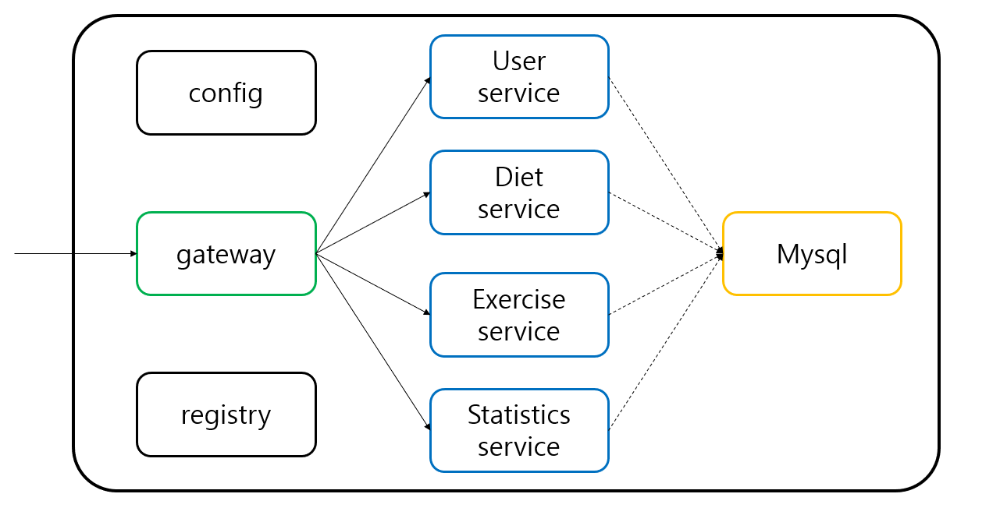

# msa-study

spring cloud 및 netflix OSS를 이용해 MSA를 구축해보기 위한 실습 코드입니다.

## 주제

헬스/영양 관리 애플리케이션

## 기능
- 사용자 관리 (회원가입 / 로그인 / 회원정보 수정 등)
- 헬스한 내용 입력 (운동 종류 / 볼륨)
- 음식별 칼로리 및 탄단지 검색
- 하루 먹은거 입력
- 입력받은 내용으로 헬스/영양 통계 제공 (달력이나 그래프 등?)

## 마이크로서비스

* 외부 기능 : 애플리케이션 외부로 노출시켜 프론트엔드와 직접 소통하는 기능
* 내부 기능 : 애플리케이션 내부에서 마이크로서비스들 간의 통신에만 사용하는 기능

### 1. 계정 마이크로서비스

#### 외부 기능

- 회원가입
- 로그인

#### 내부 기능

- 유저정보 조회

### 2. 헬스 마이크로서비스

#### 외부 기능
 
- 헬스한 내용 기록

#### 내부 기능

- 헬스 기록 조회

### 3. 영양 마이크로서비스

#### 외부 기능

- 음식별 칼로리 및 탄단지 검색
- 하루 먹은 음식의 칼로리 및 탄단지 계산 및 기록

#### 내부 기능

- 영양 기록 조회

### 4. 통계 마이크로서비스

#### 외부 기능

- 헬스 및 영양 통계 제공

## Docker

### MSA와 Docker

msa와 docker는 뗄레야 뗄 수 없는 관계에 있다고 생각한다. 도커를 기반으로 하여 AWS fargate 혹은 kubernetes등을 통해 이루어지는 컨테이너 오케스트레이션은 microservice 별로 scale-out이 가능하다는 MSA의 장점과 특히 잘어울린다. [관련 게시글 바로가기](https://velog.io/@dvmflstm/MSA%EB%A1%9C-%ED%97%AC%EC%8A%A4%EC%98%81%EC%96%91-%EA%B4%80%EB%A6%AC-%EC%96%B4%ED%94%8C%EB%A6%AC%EC%BC%80%EC%9D%B4%EC%85%98-%EB%A7%8C%EB%93%A4%EA%B8%B0-3-%EB%8F%84%EC%BB%A4%EB%9D%BC%EC%9D%B4%EC%A6%88)

## 프론트엔드

지금까지 만들었던 MSA 기반의 백엔드 어플리케이션과 소통할 프론트엔드를 간단하게 만들어보았다. UI를 만드는 것이 이번 실습의 주된 목표는 아니었기에 기존에 사용하던 스택을 그대로 사용하여 가볍게 만들었다. 

### 회원가입/로그인 페이지

### 운동/식단 검색 및 기록 페이지

### 운동/식단 통계 페이지

